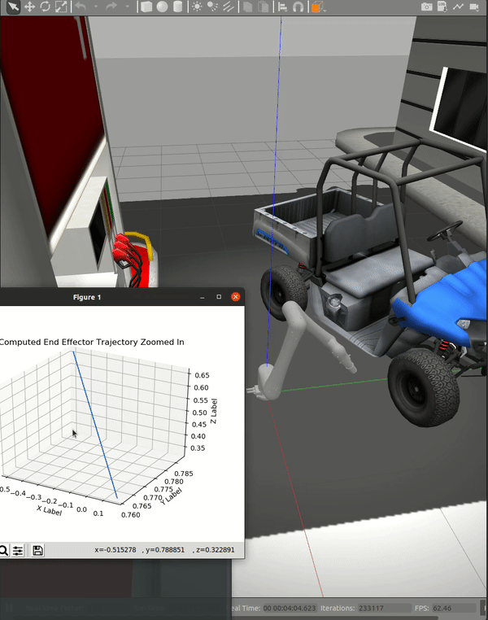

# Car Charging Robot

## Authors
Vinay Lanka

Vikram Setty

## Introduction

This repository contains a ROS 2 (tested in Galactic) package that simulates an Electric Vehicle (EV) Charging Robot based on the FANUC CRX-10iA/L cobot in a Gazebo simulation environment.

On running the simulation from the launch file (instructions listed below), the Fanuc Cobot Arm docks its Tesla J1772 Charging Adapter (end-effector) along the plane of the Polaris Ranger EV's charging port in real time.

The package makes use of a template and point cloud matching based 3D (stereo) camera perception system and a damped least squares Jacobian velocity based inverse kinematics (IK) solver, both of which are custom implmentations.

Below is the video depicting the simulation run showing the arm docking in the vehicle's charging port in real-time. Additionally, the original video can be viewed as the `media/sim.gif` file.

<p align="center">
  
</p>

## Perception Module

For perception (detecting and localizing the postion and orientation of the charging port of the EV), a stero/3D/RGBD camera is used. In this package, the depth camera Gazebo plugin is called to simulate the RGBD readings (image and point cloud). To extend this package to real hardware systems, any stereo camera like an Intel RealSense D435 or Asus Xtion Pro can be fitted to the robot/system.

The first level of perception includes template matching (based on the reference image of the charging port, present as the file `images/template.png`) by comparing cross-correlation (between the tamplate and captured image) at different scales and selecting the best fit, from where bounding box information is extracted.

After calculating the central pixel of the bouding box, the corresponding point in the point cloud is localized to get the the 3D coordinates of the charging port in the camera's frame of reference (second layer of perception). Further, the vector normal to the plane best fitting the points corresponding to the central pixel and the others surrounding it is calculated and the desired orienation is published along with the position, which are later converted to the arm's base coordinate frame.

## Inverse Kinematics Solver

To mitigate the high joint velocity effects of the Jacobian Inverse and Jacobian Transpose IK velocity methods when approaching singularity positions, this package makes use of a custom damped least squares Jacobian velocity IK implementation, using a Simgularity Resistant Inverse (SRI) Matrix (J*) that keeps joint velocities in check and avoids the robot from reaching near-singularity configurations.


## Dependencies
This project makes use of the ROS Galactic Geochelone distribution on an Ubuntu 20.04 operating system. Find installation instructions for ROS 2 Galactic [here](https://docs.ros.org/en/galactic/Installation.html).

Other library dependencies of this package includes Python 3's Numpy, Matplotlib, Open CV, and Scipy packages. They can be installed using the commands listed below (make sure Python 3 and pip3 are installed on your system beforehand).
```bash
# Install Numpy
$ pip3 install numpy
```
```bash
# Install Matplotlib
$ python3 -m pip install -U matplotlib
```
```bash
# Install Open CV
$ pip3 install opencv-python
```
```bash
# Install Scipy
$ python3 -m pip install scipy
```

Other ROS package dependencies are taken care of automatically by running the *rosdep* command, as shown in the following sections.

## Building and Installing the Package

To setup and build the package, run the commands below (these instructions build the package in a newly created ROS 2 workspace)
```bash
# Initially, run the source command
$ source /opt/ros/galactic/setup.bash
# Make your ROS 2 workspace
$ mkdir -p ~/ros_ws/src
# Go to the source directory of your ROS 2 workspace
$ cd ~/ros_ws/src
#Clone the repository
$ git clone https://github.com/vikrams169/Car-Charging-Robot.git
#Go back to the ROS 2 workspace directory
$ cd ~/ros_ws
# Install rosdep dependencies before building the package
$ rosdep install -i --from-path src --rosdistro galactic -y
# Build the package using colcon build
$ colcon build --packages-select crx_description
```

## Running the Simulation

To launch the world with the arm and the 3D Camera, open a terminal and run the following commands
```bash
# Initially, run the source command
$ source /opt/ros/galactic/setup.bash
# Navigate to your ROS 2 workspace
$ cd ~/ros_ws
# Source the install bash script
$ source ./install/setup.bash
# Launch the Gazebo world by executing the launch file
$ ros2 launch crx_description car_world.launch.py
```
To run the perception node, open up another terminal tab/window and run
```bash
# Initially, run the source command
$ source /opt/ros/galactic/setup.bash
# Navigate to your ROS 2 workspace
$ cd ~/ros_ws
# Source the install bash script
$ source ./install/setup.bash
# Run the node to start the perception system
$ ros2 run crx_description perception_node.py
```
To run the trajectory publisher node open up another terminal and run
```bash
# Initially, run the source command
$ source /opt/ros/galactic/setup.bash
# Navigate to your ROS 2 workspace
$ cd ~/ros_ws
# Source the install bash script
$ source ./install/setup.bash
# Run the node to start the IK solver to start the robot's trajectory
$ ros2 run crx_description ik_publisher.py
```
